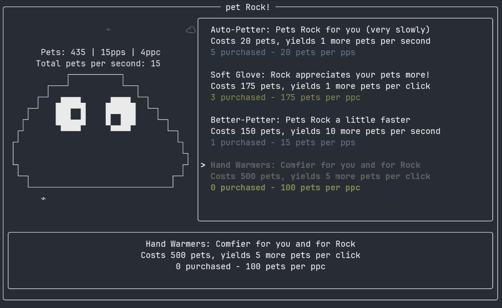

# pet Rock!

**A terminal clicker game where you pet your Pet Rock, Rock!**

Includes mouse support, balanced upgrades and progression, original music, sound effects, and even an ending!

## Installation and Usage

If you're on x64 Windows or Linux, there's archives with binaries in the release page. Extract them and run them inside the folder to play.

Otherwise, clone the repository with `git`, install Rust, and run `cargo r` in a terminal in the folder to begin!

Once in, press space or left click Rock to pet them. Use the arrow keys and left click to select items, and enter or right click to buy them. Use ',' and '.' to turn the volume down and up, respectively. You can press 'q' or Ctrl-C at anytime to quit, but be warned, you will lose all of your progress! (if you really need to, adjust line 59 of main.rs to catch back up.)

Thanks to the developers of Ratatui and Rodio for making the terminal interface and audio possible.

Have fun playing! There may be something special when you buy the last upgrade...
